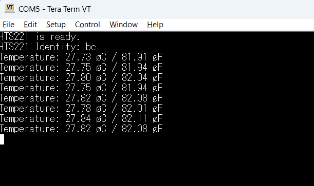

# Reading the HTS221 sensor

This program runs on the B-L475E-IOT01A evaluation board (which uses a STM32L475VG) and monitors the output of the onboard temperature / humidity sensor, the HTS221.

I started with STM32CubeMX to configure the I2C2 and generate framework code. I then implemented a simple driver to interface with the HTS221 via interrupts and a FIFO. The driver includes blocking functions to read and write to the sensor's registers and also convert its ADC temperature data to celsius and farenheit.

Sample output:

